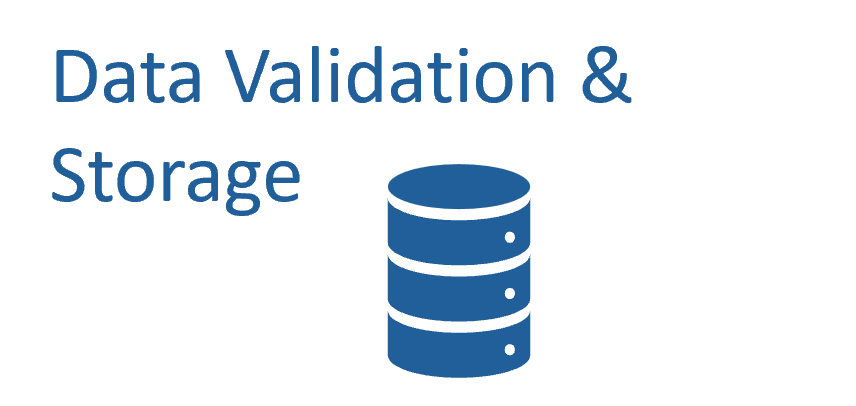
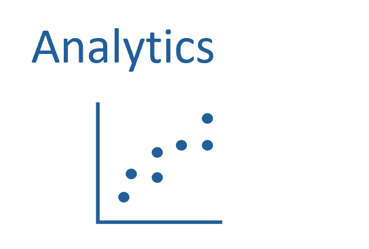
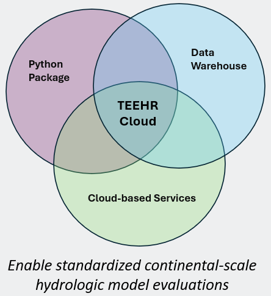

| | |
| --- | --- |
|  | Funding for this project was provided by the National Oceanic & Atmospheric Administration (NOAA), awarded to the Cooperative Institute for Research to Operations in Hydrology (CIROH) through the NOAA Cooperative Agreement with The University of Alabama (NA22NWS4320003). |

# TEEHR - Tools for Exploratory Evaluation in Hydrologic Research
TEEHR-Python  (pronounced “teer”) is an opinionated Python framework for fetching, loading, storing, and processing large amounts hydrologic simulation data for the purpose of exploring and evaluating the datasets to assess their skill and performance.

## Documentation
[TEEHR Documentation](https://rtiinternational.github.io/teehr/)

## How to Install TEEHR (macOS/Linux)
The easiest way to install TEEHR is from PyPI using `pip`. If using `pip` to install TEEHR, we recommend installing TEEHR in a virtual environment. Detailed installation instuctions for macOS/Linux users are available [here](https://rtiinternational.github.io/teehr/getting_started/index.html#installation-guide-for-macos-linux) under 'Installation Guide for macOS & Linux'.

## How to Install TEEHR (Windows)
Currently, TEEHR dependencies require users install on Linux or macOS. To use TEEHR on Windows, we recommend Windows Subsystem for Linux (WSL). Detailed installation instructions for Windows users are available [here](https://rtiinternational.github.io/teehr/getting_started/index.html#installation-guide-for-windows) under 'Installation Guide for Windows'.

## Versioning
The TEEHR project follows semantic versioning as described here: [https://semver.org/](https://semver.org/).
Note, per the specification, "Major version zero (0.y.z) is for initial development. Anything MAY change at any time. The public API SHOULD NOT be considered stable.".  We are solidly in "major version zero" territory, and trying to move fast, so expect breaking changes often.

## Main Features
The TEEHR-Python package is comprised of three main features:

<table>
  <tr>
    <td></td>
    <td><strong>Fetching and Loading</strong> - Tools to bring external or local data into your Evaluation from a variety of sources and file formats.</td>
  </tr>
  <tr>
    <td></td>
    <td><strong>Data Validation and Storage</strong> - TEEHR's data model helps ensure consistency in field values and types, and interfaces with Apache Iceberg for underlying data storage functionality.</td>
  </tr>
  <tr>
    <td></td>
    <td><strong>Analytics</strong> - TEEHR contains a suite of robust and scalable analytic methods that enable users to fully interrogate their datasets.</td>
  </tr>
</table>

## The TEEHR-Cloud Framework
The TEEHR-Cloud framework is made up of three components:
- **TEEHR-Python**: Acts as the underlying analytics engine for computing metrics and analyzing data.
- **The TEEHR Data Warehouse**: A cloud-hosted data warehouse build on Apache Iceberg conforming to TEEHR's data model.
- **TEEHR Services Stack**: A suite of cloud-based services acting as an Evaluation Manager enabling automated data ingestion, metric calculations, and dashboard visualizations.

  

