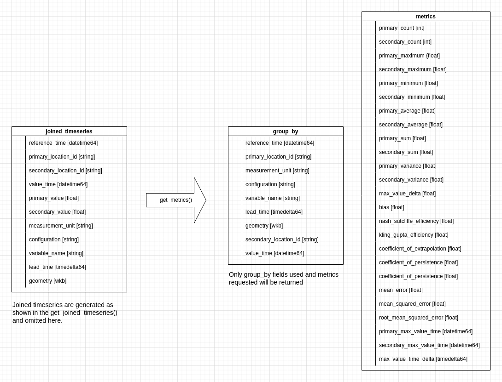

The TEEHR data library provides tools for querying data from the cached parquet files and for generating metrics.  This includes:

* Get Timeseries
* Get Timeseries Characteristics
* Get Joined Timeseries
* Get Metrics

## Get Timeseries
This feature simply get applies filters to the timeseries tables and returns the requested timeseries.

## Get Timeseries Characteristics

## Get Joined Timeseries
This feature joined two different tables of timeseries together based on location and time, applies filters and returns the paired timeseries

## Metrics
This feature starts by joining the timeseries as described above, then the timeseries are grouped to create populations, then the requested metrics are calculated.

