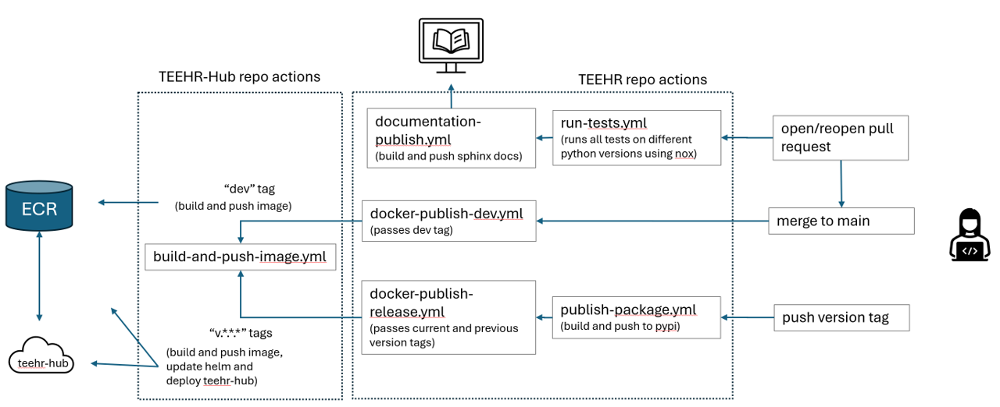

.. _development:

===============
Developer Guide
===============

Setting up the Development Environment
--------------------------------------
Setting up the development environment is a critical step in contributing to TEEHR.
This guide will walk you through the steps to set up a development environment for TEEHR.

Install the prerequisites:

- Python 3.10 or later
- Poetry v2 or later
- Java 11 or later for Spark (we use 17)

1. Clone the TEEHR repository from GitHub:

.. code-block:: bash

   git clone https://github.com/RTIInternational/teehr.git

2. Navigate to the TEEHR directory:

.. code-block:: bash

   cd teehr

3. Create a new virtual environment using poetry:

.. code-block:: bash

   poetry install

4. Activate the virtual environment:

.. code-block:: bash

   eval $(poetry env activate)

.. note::
   When upgrading to TEEHR v0.5, it is recommended to recreate your virtual environment to ensure all dependencies are correctly installed.

To re-create your poetry virtual environment, try:

.. code-block:: bash

    rm -rf .venv  # If virtualenv is in-project
    poetry env remove --all # Removes all virtualenvs associated with the project
    poetry install

Additionally, when upgrading to TEEHR v0.5, you may need to remove any older Java dependencies
that may conflict with PySpark v4.0. To do this, run:

.. code-block:: bash

   python -m teehr.utils.remove_spark_jars

Contributing Guidelines
-----------------------

These contributing guidelines will be updated as we progress. They are pretty
slim to start.

TEEHR has multiple parts, one is a library of reusable code that can be imported
as a dependency to another project, another is examples and dashboards which are
more use case specific (e.g., a dashboard to conduct post event analysis). The
guidelines for contributing may be a bit different.

Library Code
^^^^^^^^^^^^
- Use `PEP 8 <https://peps.python.org/pep-0008/>`_
- Use LFS for large files
- Write tests - you are going to test your code, why not write an actual test
  `pytest <https://docs.pytest.org/en/7.3.x/>`_.
- Use the Numpy doc string format
  `numpydoc <https://numpydoc.readthedocs.io/en/latest/format.html>`_

Git LFS
^^^^^^^
Use git lfs for large files.  Even better keep large files out of the repo.

Notebooks
^^^^^^^^^
- Do not commit notebook output to the repo.  Use can install and use `nbstripout`
  to strip output.  After cloning, you must run `nbstripout --install`.

`nbstripoutput` is configured to strip output from notebooks to keep the size down
and make diffing files easier. See https://github.com/kynan/nbstripout.
The configuration is stored in the `.gitattributes` file, but the tool must be
installed per repo. You may need to install the Python package first with
`conda install nbstripout` or similar depending on your environment.

Local Development
^^^^^^^^^^^^^^^^^
The most common way to use TEEHR is by installing it in a Python virtual
environment.  The document covers using a conda virtual environment, but
there is no hard requirement to do so.  In this case the packages are not
installed, so you need to make sure you add ``src/`` to your Python path.
There are two way to do this below, but depending on your development
environment, your milage may vary.

Release Process
^^^^^^^^^^^^^^^
This document describes the release process which has some manual steps to complete.

Create branch with the following updated to the new version (find and replace version number):

- ``pyproject.toml``
- ``src/teehr/__init__.py``

Update the changelog at ``docs/sphinx/changelog/index.rst`` to reflect the changes included in the release.

Make a PR to main.  After PR has been reviewed and merged, checkout ``main`` pull changes and tag the commit.

.. code-block:: bash

   git checkout main
   git pull
   git tag -a v0.x.x -m "version 0.x.x"
   git push origin v0.x.x

Tagging will trigger a docker container build and push to the AWS registry for deployment to TEEHR-HUB.
Deployment to TEEHR-HUB is a manual process that requires the correct credentials.

Contributing to the Documentation
---------------------------------
* description
* docstring approach (numpy)
* pre-commit validation
* building and pushing docs

The documentation files are in the ``docs/sphinx`` directory.

To build the documentation html files, navigate to ``docs/sphinx`` and run:

.. code-block:: bash

   make clean html

Check your files locally in a browser such as Firefox:

.. code-block:: bash

   firefox _build/html/index.html &

Or you can use sphinx-autobuild from the repo root directory to automatically rebuild the docs when you make changes:

.. code-block:: bash

   sphinx-autobuild docs/sphinx docs/sphinx/_build/html/

Some pre-commit hooks are configured automatically run when you commit some code.
These check for things like large files, docstring formatting, added whitespace, etc.
To run these manually and print the results to a text file `pre-commit-output.txt`, run:

.. code-block:: bash

   pre-commit run --all-files > pre-commit-output.txt

TEEHR Development CI/CD
-----------------------
The TEEHR repository uses GitHub Actions for continuous integration and continuous deployment (CI/CD).

When a pull request is opened or re-opened, the tests are run in multiple python environments using ``nox`` and ``pytest``,
and the documentation is built and published. After any necessary changes are made, the pull request can be merged,
which triggers the deployment of the ``Dev Version`` (built from main) to TEEHR-Hub.

When a new version of TEEHR is released, a new tag is created, which triggers the deployment of the tagged version to TEEHR-Hub.

``nox`` can also be used locally to run the tests in multiple python environments which must be installed separately (using ``pyenv`` for example).

.. code-block:: python

   @nox_poetry.session(python=["3.12", "3.13"])
   def single_test(session):
      """Run a single test using pytest."""
      session.install("pytest", ".")
      session.run(
         "pytest",
         "tests/test_clone_from_s3.py"
      )

The above example code from the noxfile.py demonstrates how to run a single test using pytest in a nox session
for python 3.12 and 3.13. It can be called from the command line using:

.. code-block:: bash

   nox -s single_test