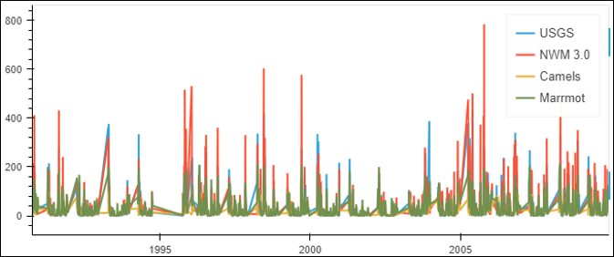
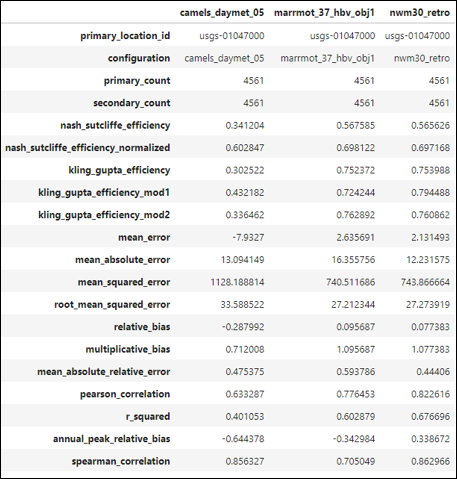
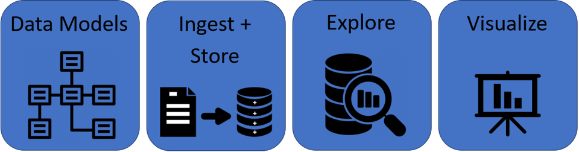

.. _getting_started:

===============
Getting started
===============

Installation
------------
There are several methods currently available for installing TEEHR.

You can install from github:

.. code-block:: python

   # Using pip
   pip install 'teehr @ git+https://github.com/RTIInternational/teehr@[BRANCH_TAG]'

   # Using poetry
   poetry add git+https://github.com/RTIInternational/teehr.git#[BRANCH TAG]

You can use Docker:

.. code-block:: bash

   docker build -t teehr:v0.3.26 .
   docker run -it --rm --volume $HOME:$HOME -p 8888:8888 teehr:v0.3.26 jupyter lab --ip 0.0.0.0 $HOME

An Introduction to TEEHR
------------------------

TEEHR is a collection of tools for evaluating and exploring hydrologic timeseries data. It is designed to be efficient, modular, and flexible,
allowing users to work with a variety of data sources and formats. Quantifying the performance of a model can be a relatively simple task
consisting of comparing the model output to observed data through a series of metrics.

.. container:: center-icon

   :material-regular:`arrow_downward;3.5em;sd-text-success`

   Evaluating simulations vs. observations through a series of performance metrics.

Understanding the reasons `why` a model performs well or poorly is a more complex task. It requires efficient, iterative
exploration of the data, often across large spatial and temporal scales.

These are the challenges that TEEHR is designed to address.

.. note::

   TEEHR is designed to provide efficient iterative exploration of billions of rows of timeseries data
   across large spatial and temporal scales.

At its core, TEEHR consists of four main components:

* **Data Models**: A set of schemas that define the structure of the data.
* **Data Ingest and Storage**: Tools for fetching and loading hydrologic data into an efficient storage format.
* **Exploration**: A set of tools for quantifying and understanding model performance.
* **Visualization**: Tools for visualizing the data and results. [work-in-progress]

   The four main components of TEEHR.

TEEHR Components
----------------

For more details on each component of TEEHR, see the following tutorials:

:ref:`Data Models <data_model>`

:doc:`Fetching and Loading Data </user_guide/notebooks/loading_examples_index>`

:ref:`Metric Queries <queries>`

:doc:`Evaluation and Visualization </user_guide/notebooks/evaluation_examples_index>`

Additional Tutorials
--------------------

:doc:`/tutorials/joining_timeseries`

:doc:`/tutorials/grouping_and_filtering`

For a full list of metrics currently available in TEEHR, see the :doc:`/user_guide/metrics/metrics` documentation.

.. toctree::
    :maxdepth: 2
    :hidden:

    Data Models <data_model>
    Metric Queries <queries>
    /tutorials/tutorials_index