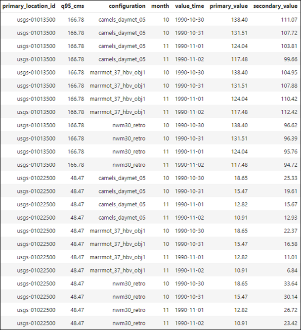
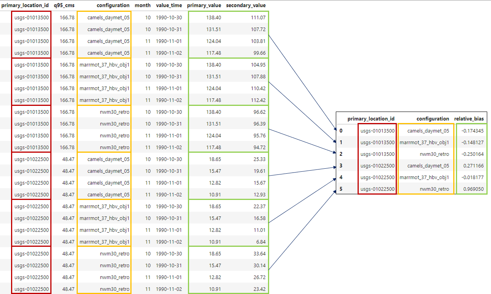
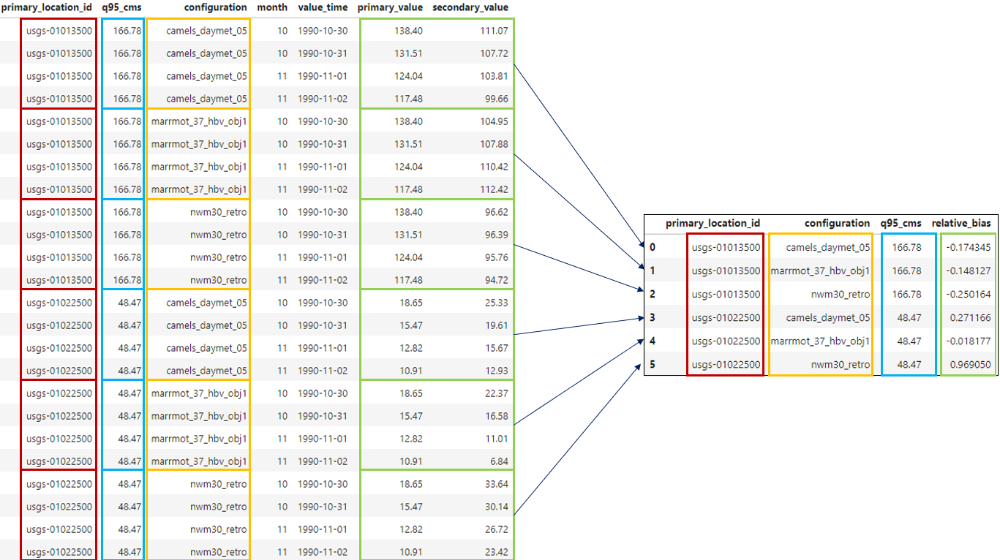
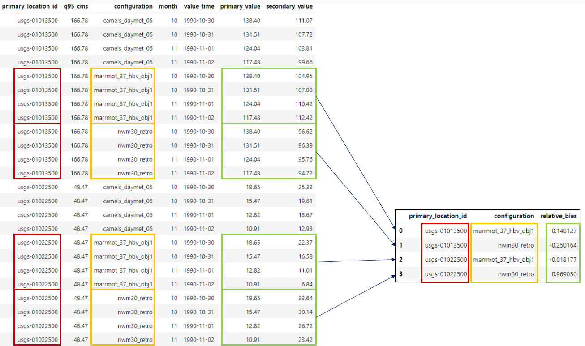

.. grouping_filtering:

Grouping and Filtering
======================

Once the data has been joined into a single table, we can start to group and filter the data based on the table attributes,
and calculate metrics for specific subsets of the data.  This is the explorative power of TEEHR, and allows us to
better understand model performance. For example, if the joined table contained several model simulations ("configurations")
we could group the ``configuration`` field to calculate performance metrics for each model configuration.

We could then include filters to further narrow the population subset such as only considering first order stream locations or
locations below a certain mean slope value. This allows us to gain more insight into the model performance through specific
quantitative analysis.

.. note::
    The grouping and filtering capabilities in TEEHR provide the ability to explore models across
    different subsets of the data, allowing us to better understand where and why the model performs well or poorly.

We'll look at an example to help illustrate the grouping and filtering concepts.

    Example joined timeseries table.

Consider this joined timeseries table containing:

* 2 USGS locations
* 3 Model configurations
* 4 Daily timesteps spanning two months
* 1 Location attribute (q95_cms)
* 1 User-defined attribute (month)

When calculating metrics in TEEHR, we can use the data in this table to calculate metrics over specific subsets or
populations of the data. For example, we could calculate the relative bias for each model configuration for each month.

Grouping
--------

Let's use this table of joined timeseries values to demonstrate how grouping selected fields affects the results.

First, we'll calculate the relative bias for each model configuration at each location:

    Grouping the timeseries table by configuration.

Performing this calculation in TEEHR might look something like this:

.. code-block:: python

    # First, we initialize a teehr joined parquet class with our parquet file.
    from teehr.classes.duckdb_joined_parquet import DuckDBJoinedParquet

    TEEHR_BASE = Path(Path.home(), 'teehr/example-2')
    JOINED_FILEPATH = f"{TEEHR_BASE}/joined/teehr_joined.parquet"

    joined_data = DuckDBJoinedParquet(
        joined_parquet_filepath = JOINED_FILEPATH
    )

    # Now, we calculate the relative bias for each model configuration and location.
    joined_data.get_metrics(
        group_by=["primary_location_id", "configuration"],
        include_metrics=[
            'relative_bias',
        ]
    )

Note that if you wanted to include a field in the query result, it must be included in the ``group_by`` list
even if it's not necessary for the grouping operation!

For example, if we wanted to include ``q95_cms`` in the query result, we would need to include it in the
``group_by`` list:

    Grouping the timeseries table by configuration.

.. code-block:: python

    # Adding q95_cms to the group_by list to include it in the results.
    joined_data.get_metrics(
        group_by=["primary_location_id", "configuration", "q95_cms"],
        include_metrics=[
            'relative_bias',
        ]
    )

Filtering
---------

Next, we'll add filtering to further narrow the population for our metric calculations. Let's say we only
want to consider ``NWM v3.0`` and ``Marrmot`` model configurations:

    Grouping the timeseries table by configuration and filtering for NWM v3.0 and Marrmot.

We need to specify a filter in the ``get_metrics`` function to only include the desired model configurations:

.. code-block:: python

    # Adding a filter to further limit the population for metrics calculations.
    joined_data.get_metrics(
        group_by=["primary_location_id", "configuration", "q95_cms"],
        include_metrics=[
            'relative_bias',
        ],
        filters = [
            {
                "column": "configuration",
                "operator": "in",
                "value": ["nwm30_retro", "marrmot_37_hbv_obj1"]
            }
        ]
    )

Summary
-------

Grouping and filtering are powerful tools in TEEHR that allow us to explore the data in more detail and calculate metrics
for specific subsets of the data.

See the User Guide for more in-depth examples using the code base.