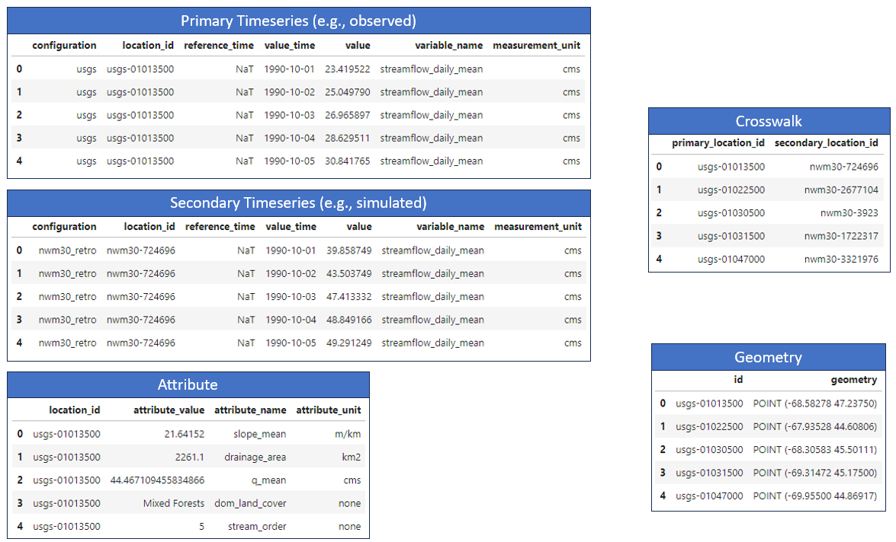
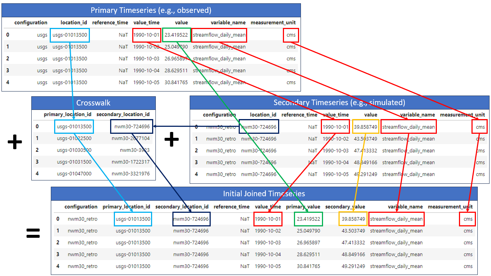
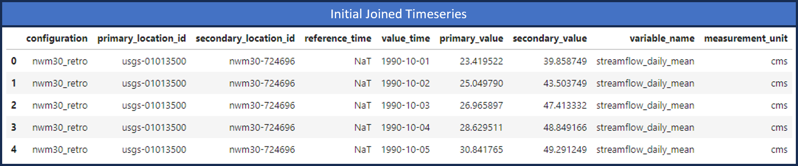
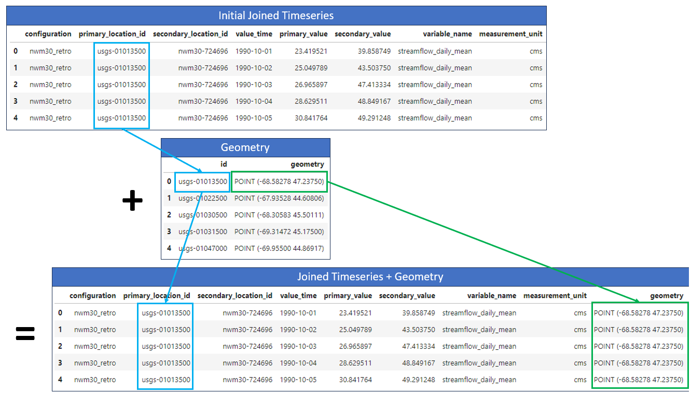

.. _joining_timeseries:

Joining Timeseries
==================

One of the first and most important steps in comparing simulated and observed timeseries data is to join
the two datasets together based on location and time (and potentially other fields).

In this example, we consider a comparison of National Water Model (NWM) v3.0 retrospective
streamflow simulations ("secondary") to USGS observed streamflow data ("primary") for a few
time steps at five different locations (gage stations).

When the timeseries and attributes have been brought into the TEEHR data model, it will look something like this:

   Example NWM and USGS data in the TEEHR data model.

* **Primary Timeseries**: The USGS observed streamflow data at all locations and times.
* **Secondary Timeseries**: The NWM v3.0 retrospective streamflow simulations at all locations and times.
* **Crosswalk**: A mapping between the USGS and NWM location IDs.
* **Geometry**: The point geometries of the USGS gage station locations.
* **Attributes**: Additional information about each of the locations.

Ultimately, we want to combine all the data into a single table to facilitate efficient analysis and exploration based
on the location, time, and potentially some other attributes.  For example, we could start to ask questions like:
"How does the NWM model perform in primarily forested watersheds compared to primarily urban watersheds?"

First, we can join the primary and secondary timeseries by location and time without adding geometry or
attributes.  This requires the crosswalk table to map the primary and secondary location IDs. Because
the data may contain more than one variable (e.g., temperature, C) we also need to consider the `variable_name`
and `measurement_unit` fields during the join.

   Joining the primary and secondary streamflow values by location, time, variable name, and measurement unit.

The initial joined timeseries table will look like this:

   Example joined timeseries table.

Now we can join the location geometry and attributes to the joined timeseries table.  This will allow us to
easily filter and group the data based on the location attributes, and to visualize the output.

To join the geometry, we can simply map each primary location ID in the joined timeseries table to the ID in the
geometry table, which in this case contains the point geometries of the USGS gage stations.

   Joining the geometry to the initial joined timeseries table.

Finally, we can join additional, pre-calculated attributes the table, which give us more options for
filtering and grouping the data when calculating performance metrics.

.. figure:: ../../images/tutorials/joining/nwm_usgs_ex_joining_attributes.png
   :scale: 60%

   Joining the attributes to the initial joined timeseries table.

Now that the data is joined into a single table, we can easily filter and groupby the available fields to pre-calculated
performance metrics, such as the Nash-Sutcliffe Efficiency (NSE) or the Kling-Gupta Efficiency (KGE), and create visualizations.