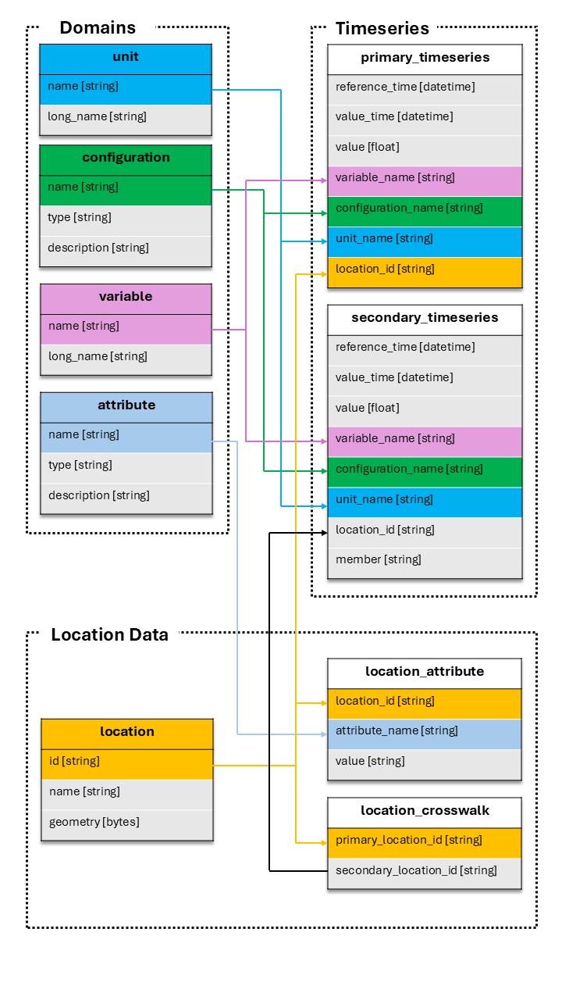

.. _tables:

======
Tables
======

Tables are the core data structures in TEEHR. They represent persistent Iceberg tables
that store your evaluation data. This section covers the table schema, loading methods,
querying, and method chaining.

The TEEHR Schema
================

TEEHR uses a structured schema with three categories of tables:

**Domain Tables** (small reference data, CSV-like):

- :class:`units <teehr.evaluation.tables.unit_table.UnitTable>` - Measurement units (e.g., "m3/s", "ft3/s")
- :class:`variables <teehr.evaluation.tables.variable_table.VariableTable>` - Variable names (e.g., "streamflow_hourly_inst")
- :class:`configurations <teehr.evaluation.tables.configuration_table.ConfigurationTable>` - Data source configurations (e.g., "nwm30_retrospective")
- :class:`attributes <teehr.evaluation.tables.attribute_table.AttributeTable>` - Attribute definitions (e.g., "drainage_area", "ecoregion")

**Location Data**:

- :class:`locations <teehr.evaluation.tables.location_table.LocationTable>` - Point geometries with IDs (e.g., USGS gage locations)
- :class:`location_attributes <teehr.evaluation.tables.location_attribute_table.LocationAttributeTable>` - Attribute values for each location
- :class:`location_crosswalks <teehr.evaluation.tables.location_crosswalk_table.LocationCrosswalkTable>` - Maps primary IDs to secondary IDs (e.g., USGS to NWM)

**Timeseries Data**:

- :class:`primary_timeseries <teehr.evaluation.tables.primary_timeseries_table.PrimaryTimeseriesTable>` - Observed/reference data (e.g., USGS streamflow)
- :class:`secondary_timeseries <teehr.evaluation.tables.secondary_timeseries_table.SecondaryTimeseriesTable>` - Simulated/forecast data (e.g., NWM outputs)

Accessing Tables
================

There are two ways to access a table:

.. code-block:: python

   import teehr

   ev = teehr.LocalReadWriteEvaluation(dir_path="./my_eval")

   # Method 1: Named property (for standard tables)
   locs = ev.locations
   pts = ev.primary_timeseries
   sts = ev.secondary_timeseries

   # Method 2: Generic accessor (for any table)
   pts = ev.table("primary_timeseries")
   custom = ev.table("my_custom_table")  # User-defined tables

Both methods return a table object with the same methods.

Table Methods Overview
======================

All tables inherit common methods from the :class:`BaseTable <teehr.evaluation.tables.base_table.BaseTable>` class:

**Output Methods:**

- :meth:`to_sdf() <teehr.evaluation.tables.base_table.BaseTable.to_sdf>` - Return a PySpark DataFrame (lazy)
- :meth:`to_pandas() <teehr.evaluation.tables.base_table.BaseTable.to_pandas>` - Return a Pandas DataFrame (eager)
- :meth:`to_geopandas() <teehr.evaluation.tables.base_table.BaseTable.to_geopandas>` - Return a GeoPandas GeoDataFrame (eager)

**Query Methods:**

- :meth:`filter() <teehr.evaluation.tables.base_table.BaseTable.filter>` - Apply filters
- :meth:`order_by() <teehr.evaluation.tables.base_table.BaseTable.order_by>` - Sort results
- :meth:`query() <teehr.evaluation.tables.base_table.BaseTable.query>` - Combined filter, group, metrics, order
- :meth:`add_calculated_fields() <teehr.evaluation.tables.base_table.BaseTable.add_calculated_fields>` - Add computed columns
- :meth:`add_geometry() <teehr.evaluation.tables.base_table.BaseTable.add_geometry>` - Join geometry from locations table

**Output Operations:**

- :meth:`write() <teehr.evaluation.tables.base_table.BaseTable.write>` - Write results to a new table

Loading Data
============

Tables have methods to load data from various file formats. The loading process
validates data against the table schema and handles duplicates.

Loading Timeseries Data
-----------------------

Primary and secondary timeseries tables support multiple formats.

**From Parquet:**

.. code-block:: python

   ev.primary_timeseries.load_parquet(
       in_path="./data/observed.parquet",
       field_mapping={
           "datetime": "value_time",
           "discharge": "value",
           "site_no": "location_id"
       },
       constant_field_values={
           "configuration_name": "usgs_observations",
           "variable_name": "streamflow_hourly_inst",
           "unit_name": "m3/s"
       },
       location_id_prefix="usgs"
   )

See also: :meth:`PrimaryTimeseriesTable.load_parquet() <teehr.evaluation.tables.primary_timeseries_table.PrimaryTimeseriesTable.load_parquet>`

**From CSV:**

.. code-block:: python

   ev.secondary_timeseries.load_csv(
       in_path="./data/forecasts/",
       pattern="**/*.csv",
       field_mapping={
           "forecast_time": "reference_time",
           "valid_time": "value_time",
           "flow": "value"
       },
       constant_field_values={
           "configuration_name": "my_model_v1",
           "variable_name": "streamflow_hourly_inst",
           "unit_name": "m3/s"
       }
   )

See also: :meth:`SecondaryTimeseriesTable.load_csv() <teehr.evaluation.tables.secondary_timeseries_table.SecondaryTimeseriesTable.load_csv>`

**From NetCDF:**

.. code-block:: python

   ev.secondary_timeseries.load_netcdf(
       in_path="./data/model_output.nc",
       field_mapping={"streamflow": "value"},
       constant_field_values={"configuration_name": "model_run_001"}
   )

See also: :meth:`SecondaryTimeseriesTable.load_netcdf() <teehr.evaluation.tables.secondary_timeseries_table.SecondaryTimeseriesTable.load_netcdf>`

**From FEWS PI-XML:**

.. code-block:: python

   ev.primary_timeseries.load_fews_pixml(
       in_path="./data/observed.xml",
       location_id_prefix="fews"
   )

See also: :meth:`PrimaryTimeseriesTable.load_fews_xml() <teehr.evaluation.tables.primary_timeseries_table.PrimaryTimeseriesTable.load_fews_xml>`

Loading Parameters
------------------

Common parameters for loading methods:

``field_mapping`` : dict
    Maps source column names to TEEHR schema names::

        {"source_col": "teehr_col"}

``constant_field_values`` : dict
    Sets constant values for fields not in source data::

        {"configuration_name": "my_config", "unit_name": "m3/s"}

``location_id_prefix`` : str
    Prefix added to location IDs for uniqueness::

        location_id_prefix="usgs"  # "12345" becomes "usgs-12345"

``write_mode`` : str
    - ``"append"`` - Add new data (default)
    - ``"upsert"`` - Update existing, add new
    - ``"create_or_replace"`` - Replace entire table

``drop_duplicates`` : bool
    Remove duplicate rows during validation (default: True)

Loading Location Data
---------------------

Load locations from GeoJSON or other spatial formats.

.. code-block:: python

   ev.locations.load_spatial(
       in_path="./data/gages.geojson"
   )

See also: :meth:`LocationTable.load_spatial() <teehr.evaluation.tables.location_table.LocationTable.load_spatial>`

Load location attributes.

.. code-block:: python

   ev.location_attributes.load_csv(
       in_path="./data/attributes.csv"
   )

See also: :meth:`LocationAttributeTable.load_csv() <teehr.evaluation.tables.location_attribute_table.LocationAttributeTable.load_csv>`

Load crosswalks.

.. code-block:: python

   ev.location_crosswalks.load_csv(
       in_path="./data/crosswalk.csv",
       field_mapping={
           "usgs_id": "primary_location_id",
           "nwm_id": "secondary_location_id"
       }
   )

See also: :meth:`LocationCrosswalkTable.load_csv() <teehr.evaluation.tables.location_crosswalk_table.LocationCrosswalkTable.load_csv>`

Loading Domain Data
-------------------

Domain tables can be populated manually.

.. code-block:: python

   # Or add individual records
   ev.configurations.add(
       teehr.Configuration(name="my_model", type="model", description="My custom model")
   )

See also: :meth:`ConfigurationTable.add() <teehr.evaluation.tables.configuration_table.ConfigurationTable.add>`

Using DataFrames
----------------

You can also load from Pandas/GeoPandas DataFrames:

.. code-block:: python

   import pandas as pd

   df = pd.DataFrame({
       "location_id": ["usgs-01234"],
       "value_time": ["2024-01-01 00:00:00"],
       "value": [100.5],
       "variable_name": ["streamflow_hourly_inst"],
       "unit_name": ["m3 s-1"],
       "configuration_name": ["usgs_observations"]
   })

   ev.load.dataframe(df=df, table_name="primary_timeseries")

Filtering Data
==============

Filter tables to select specific subsets of data.

**SQL String Filters:**

.. code-block:: python

   ev.primary_timeseries.filter(
       "location_id LIKE 'usgs%'"
   ).to_sdf().show()

   ev.primary_timeseries.filter([
       "value_time > '2024-01-01'",
       "value_time < '2024-02-01'"
   ]).to_sdf().show()

**Dictionary Filters:**

.. code-block:: python

   ev.primary_timeseries.filter({
       "column": "location_id",
       "operator": "like",
       "value": "usgs%"
   }).to_sdf().show()

**TableFilter Objects:**

.. code-block:: python

   from teehr.models.filters import TableFilter
   from teehr import Operators as ops

   ev.primary_timeseries.filter(
       TableFilter(column="value", operator=ops.gt, value=100)
   ).to_sdf().show()

See also: :meth:`PrimaryTimeseriesTable.filter() <teehr.evaluation.tables.primary_timeseries_table.PrimaryTimeseriesTable.filter>`

Method Chaining
===============

Table methods return ``self`` to enable fluent method chaining:

.. code-block:: python

   from teehr import RowLevelCalculatedFields as rcf
   from teehr import DeterministicMetrics as dm

   # Chain multiple operations
   result = (
       ev.joined_timeseries_view()
       .filter("primary_location_id LIKE 'usgs%'")
       .add_calculated_fields([rcf.Month(), rcf.WaterYear()])
       .query(
           include_metrics=[
               dm.KlingGuptaEfficiency(),
               dm.RelativeBias()
           ],
           group_by=["primary_location_id", "month"]
       )
       .order_by(["primary_location_id", "month"])
       .to_pandas()
   )

Writing Results
===============

Write query results to new tables:

.. code-block:: python

   # Calculate metrics and save to a new table
   ev.joined_timeseries_view().query(
       include_metrics=[dm.KlingGuptaEfficiency()],
       group_by=["primary_location_id", "configuration_name"]
   ).write("location_metrics")

   # Access the new table
   metrics_df = ev.table("location_metrics").to_pandas()

Inspecting Tables
=================

Get information about table contents:

.. code-block:: python

   # List all tables
   ev.list_tables()

   # Get distinct values for a column
   ev.primary_timeseries.distinct_values("location_id")

   # Get location prefixes
   ev.primary_timeseries.distinct_values("location_id", location_prefixes=True)

   # View schema (via Spark)
   ev.primary_timeseries.to_sdf().printSchema()

Direct SQL Access
=================

For complex queries, use SQL directly:

.. code-block:: python

   df = ev.sql("""
       SELECT
           location_id,
           COUNT(*) as record_count,
           MIN(value_time) as first_date,
           MAX(value_time) as last_date
       FROM primary_timeseries
       GROUP BY location_id
   """)
   df.show()
