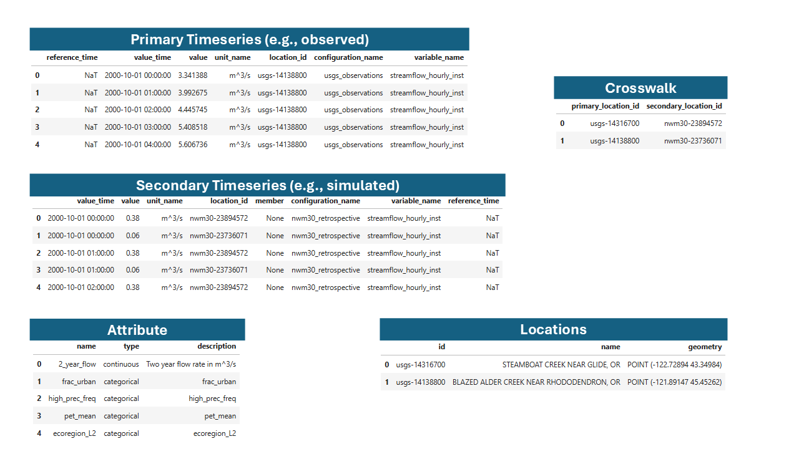
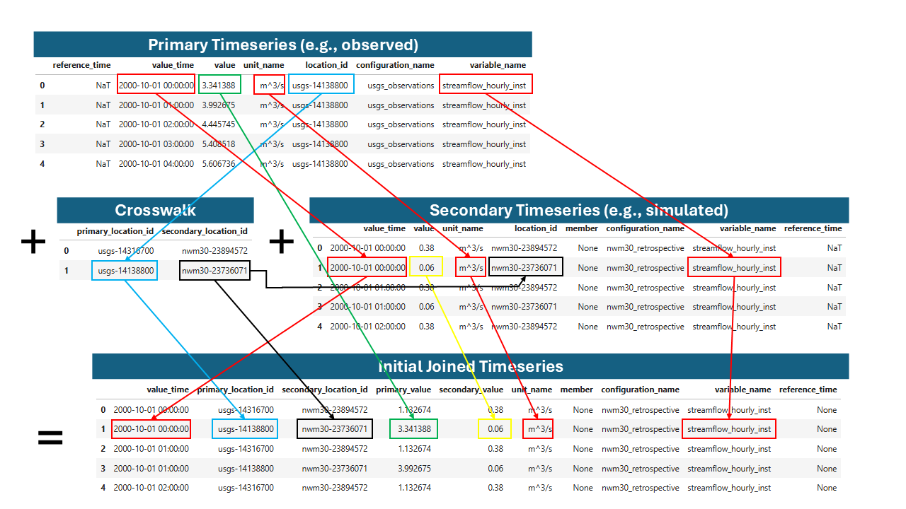
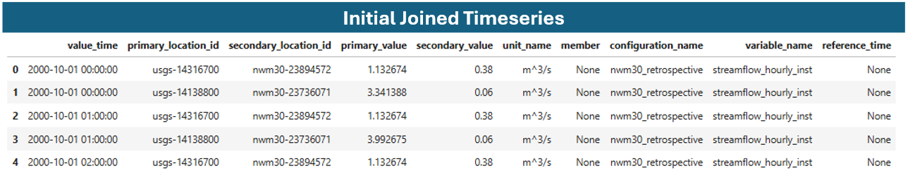
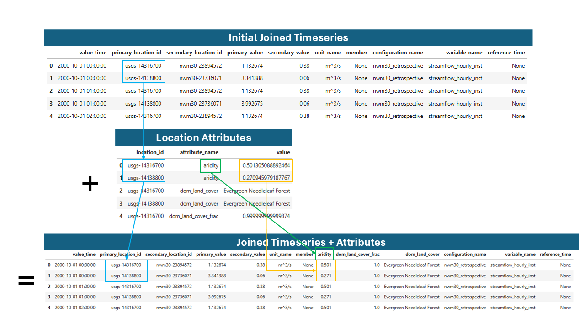

.. _views:

*****
Views
*****

Views are computed DataFrames that dynamically join and transform data from multiple
tables on-the-fly. Unlike persisted tables, views compute their data when accessed
and can optionally be materialized to tables for performance.

JoinedTimeseriesView
====================

The ``JoinedTimeseriesView`` is the most commonly used view, joining primary and secondary
timeseries data with location crosswalks and optionally adding location attributes.

Understanding the Join Process
------------------------------

   Example NWM and USGS data in the TEEHR data model.

The view brings together multiple tables:

- **Primary Timeseries**: Observed data (e.g., USGS streamflow)
- **Secondary Timeseries**: Simulated data (e.g., NWM forecasts)
- **Crosswalk**: Mapping between primary and secondary location IDs
- **Locations**: Point geometries
- **Attributes**: Additional location metadata

   Joining primary and secondary values by location, time, variable name, and unit.

The result is a unified table for analysis:

   Example joined timeseries table.

Basic Usage
-----------

Create a joined timeseries view:

.. code-block:: python

    import teehr

    ev = teehr.Evaluation(dir_path="/path/to/evaluation")

    # Basic joined view
    jt = ev.joined_timeseries_view()

    # Convert to pandas DataFrame
    df = jt.to_pandas()

    # Or keep as Spark DataFrame for large datasets
    sdf = jt.to_sdf()

Adding Location Attributes
--------------------------

Join location attributes to the timeseries data:

   Joining attributes to the joined timeseries table.

.. code-block:: python

    # Add all available attributes
    jt = ev.joined_timeseries_view(add_attrs=True)

    # Add specific attributes only
    jt = ev.joined_timeseries_view(
        add_attrs=True,
        attr_list=["drainage_area", "ecoregion"]
    )

Filtering Views
---------------

Apply SQL-style filters to narrow results:

.. code-block:: python

    # Filter by location pattern
    jt = ev.joined_timeseries_view().filter(
        "primary_location_id LIKE 'usgs-%'"
    )

    # Filter by date range
    jt = ev.joined_timeseries_view().filter(
        "value_time BETWEEN '2020-01-01' AND '2020-12-31'"
    )

    # Multiple filter conditions
    jt = ev.joined_timeseries_view(add_attrs=True).filter("""
        primary_location_id LIKE 'usgs-%'
        AND drainage_area > 100
        AND configuration_name = 'nwm30_retrospective'
    """)

Materializing Views to Tables
-----------------------------

For repeated queries, materialize a view to an Iceberg table:

.. code-block:: python

    # Write view to a named table
    ev.joined_timeseries_view(add_attrs=True).write("joined_with_attrs")

    # Later, query the materialized table directly
    df = ev.table("joined_with_attrs").query(
        include_metrics=[DeterministicMetrics.KlingGuptaEfficiency()],
        group_by=["primary_location_id"]
    ).to_pandas()

Other Views
===========

LocationAttributesView
----------------------

Pivots the ``location_attributes`` table from long format to wide format, with
each attribute as a column:

.. code-block:: python

    # Pivot all attributes
    la = ev.location_attributes_view()
    df = la.to_pandas()

    # Pivot specific attributes
    la = ev.location_attributes_view(
        attr_list=["drainage_area", "percent_forest"]
    )

    # Filter and convert
    df = ev.location_attributes_view().filter(
        "location_id LIKE 'usgs%'"
    ).to_pandas()

    # Materialize for reuse
    ev.location_attributes_view().write("pivoted_attrs")

PrimaryTimeseriesView
---------------------

View of primary timeseries with optional location attributes:

.. code-block:: python

    # Basic view
    pv = ev.primary_timeseries_view()

    # With location attributes joined
    pv = ev.primary_timeseries_view(
        add_attrs=True,
        attr_list=["drainage_area", "ecoregion"]
    )

    # Filter and export
    df = ev.primary_timeseries_view().filter(
        "location_id LIKE 'usgs%'"
    ).to_pandas()

SecondaryTimeseriesView
-----------------------

View of secondary timeseries with optional location attributes:

.. code-block:: python

    # Basic view
    sv = ev.secondary_timeseries_view()

    # With attributes
    sv = ev.secondary_timeseries_view(
        add_attrs=True,
        attr_list=["drainage_area"]
    )

Calculated Fields
=================

TEEHR provides two categories of calculated fields that can be added to views:

- **Row-Level Calculated Fields**: Compute values independently for each row
- **Timeseries-Aware Calculated Fields**: Perform computations across related timeseries groups

Row-Level Calculated Fields
---------------------------

These fields operate on individual rows without aggregation:

.. code-block:: python

    import teehr.models.calculated_fields.row_level as rcf

    # Add month and water year from timestamps
    jt = ev.joined_timeseries_view().add_calculated_fields([
        rcf.Month(),       # Extracts month (1-12)
        rcf.Year(),        # Extracts calendar year
        rcf.WaterYear(),   # Computes water year (Oct-Sep)
    ])

    df = jt.to_pandas()

Available row-level fields:

.. list-table::
   :header-rows: 1
   :widths: 25 75

   * - Field
     - Description
   * - ``Month``
     - Extracts month (1-12) from timestamp
   * - ``Year``
     - Extracts calendar year from timestamp
   * - ``WaterYear``
     - Computes water year (year + 1 if month >= October)
   * - ``DayOfYear``
     - Day of year (1-366)
   * - ``HourOfYear``
     - Hour of year (0-8784)
   * - ``Seasons``
     - Maps months to seasons (winter, spring, summer, fall)
   * - ``NormalizedFlow``
     - Divides flow by drainage area
   * - ``ForecastLeadTime``
     - Computes lead time from reference_time to value_time
   * - ``ForecastLeadTimeBins``
     - Groups lead times into bins
   * - ``ThresholdValueExceeded``
     - Boolean indicating if value exceeds threshold
   * - ``ThresholdValueNotExceeded``
     - Boolean indicating if value is at or below threshold

Configuring Row-Level Fields
^^^^^^^^^^^^^^^^^^^^^^^^^^^^

Most fields have configurable parameters:

.. code-block:: python

    import teehr.models.calculated_fields.row_level as rcf

    # Custom field names and input columns
    month_field = rcf.Month(
        input_field_name="value_time",
        output_field_name="my_month_column"
    )

    # Normalized flow with custom attribute
    normalized = rcf.NormalizedFlow(
        value_field_name="primary_value",
        attribute_field_name="drainage_area",
        output_field_name="normalized_flow"
    )

    # Custom seasons mapping
    seasons = rcf.Seasons(
        season_mapping={
            "dry": [6, 7, 8, 9, 10],
            "wet": [11, 12, 1, 2, 3, 4, 5]
        },
        output_field_name="season"
    )

    jt = ev.joined_timeseries_view(add_attrs=True).add_calculated_fields([
        month_field,
        normalized,
        seasons,
    ])

Timeseries-Aware Calculated Fields
----------------------------------

These fields perform computations that require knowledge of the full timeseries,
such as percentile calculations or event detection:

.. code-block:: python

    import teehr.models.calculated_fields.timeseries_aware as tcf

    # Add event detection based on percentile threshold
    jt = ev.joined_timeseries_view().add_calculated_fields([
        tcf.AbovePercentileEventDetection(
            quantile=0.85,               # 85th percentile
            value_field_name="primary_value",
            output_event_field_name="event_above",
            add_quantile_field=True      # Also output the threshold value
        )
    ])

Available timeseries-aware fields:

.. list-table::
   :header-rows: 1
   :widths: 30 70

   * - Field
     - Description
   * - ``AbovePercentileEventDetection``
     - Flags values above a percentile threshold, assigns event IDs
   * - ``BelowPercentileEventDetection``
     - Flags values below a percentile threshold, assigns event IDs
   * - ``ExceedanceProbability``
     - Computes probability of value being exceeded
   * - ``BaseflowPeriodDetection``
     - Identifies baseflow periods in hydrograph
   * - ``LyneHollickBaseflow``
     - Baseflow separation using Lyne-Hollick filter
   * - ``ChapmanBaseflow``
     - Baseflow separation using Chapman filter
   * - ``ChapmanMaxwellBaseflow``
     - Baseflow separation using Chapman-Maxwell filter

Event Detection
===============

Event detection identifies periods where values exceed (or fall below) thresholds,
useful for analyzing high-flow or low-flow events.

Above Percentile Events
-----------------------

Detect events when values exceed a percentile threshold:

.. code-block:: python

    import teehr.models.calculated_fields.timeseries_aware as tcf

    # Detect high-flow events (above 85th percentile)
    event_detection = tcf.AbovePercentileEventDetection(
        quantile=0.85,
        value_field_name="primary_value",
        output_event_field_name="event_above",
        output_event_id_field_name="event_above_id",
        add_quantile_field=True,
    )

    jt = ev.joined_timeseries_view().add_calculated_fields([event_detection])
    df = jt.to_pandas()

    # Result includes:
    # - event_above (bool): True if value > 85th percentile
    # - event_above_id (str): Unique ID for continuous event periods
    # - quantile_value (float): The 85th percentile threshold value

Below Percentile Events
-----------------------

Detect events when values fall below a percentile threshold:

.. code-block:: python

    # Detect low-flow events (below 15th percentile)
    low_event = tcf.BelowPercentileEventDetection(
        quantile=0.15,
        value_field_name="primary_value",
        output_event_field_name="event_below",
        output_event_id_field_name="event_below_id",
    )

    jt = ev.joined_timeseries_view().add_calculated_fields([low_event])

Combining Multiple Calculated Fields
------------------------------------

Chain multiple calculated fields together:

.. code-block:: python

    import teehr.models.calculated_fields.row_level as rcf
    import teehr.models.calculated_fields.timeseries_aware as tcf

    jt = ev.joined_timeseries_view(add_attrs=True).add_calculated_fields([
        # Row-level fields
        rcf.Month(),
        rcf.WaterYear(),
        rcf.Seasons(),
        rcf.NormalizedFlow(),
        # Timeseries-aware fields
        tcf.AbovePercentileEventDetection(quantile=0.90),
    ])

    # Now query metrics grouped by these new fields
    metrics_df = jt.query(
        include_metrics=[
            DeterministicMetrics.KlingGuptaEfficiency(),
            DeterministicMetrics.NashSutcliffeEfficiency(),
        ],
        group_by=["primary_location_id", "water_year", "season"],
        order_by=["primary_location_id", "water_year"],
    ).to_pandas()

Materializing Computed Fields
-----------------------------

For repeated use, write calculated fields to a table:

.. code-block:: python

    # Compute and materialize
    ev.joined_timeseries_view().add_calculated_fields([
        tcf.AbovePercentileEventDetection()
    ]).write("joined_timeseries")

    # Query the materialized table
    metrics_df = ev.table("joined_timeseries").query(
        include_metrics=[DeterministicMetrics.KlingGuptaEfficiency()],
        group_by=["primary_location_id", "event_above"],
    ).to_pandas()

Complete Workflow Example
=========================

A typical workflow combining views, calculated fields, and metrics:

.. code-block:: python

    import teehr
    from teehr.metrics import DeterministicMetrics
    import teehr.models.calculated_fields.row_level as rcf
    import teehr.models.calculated_fields.timeseries_aware as tcf

    # Open evaluation
    ev = teehr.Evaluation(dir_path="/path/to/evaluation")

    # Create view with attributes and calculated fields
    jt = ev.joined_timeseries_view(
        add_attrs=True,
        attr_list=["drainage_area", "ecoregion"]
    ).add_calculated_fields([
        rcf.Month(),
        rcf.WaterYear(),
        rcf.Seasons(),
        rcf.NormalizedFlow(),
        tcf.AbovePercentileEventDetection(
            quantile=0.90,
            add_quantile_field=True
        ),
    ])

    # Filter to specific criteria
    jt = jt.filter("""
        primary_location_id LIKE 'usgs-%'
        AND value_time >= '2019-10-01'
        AND drainage_area < 1000
    """)

    # Query metrics grouped by computed fields
    metrics_df = jt.query(
        include_metrics=[
            DeterministicMetrics.KlingGuptaEfficiency(),
            DeterministicMetrics.RelativeBias(),
            DeterministicMetrics.RootMeanSquareError(),
        ],
        group_by=["primary_location_id", "water_year", "ecoregion"],
        order_by=["primary_location_id", "water_year"],
    ).to_pandas()

    print(metrics_df.head())

    # Clean up
    ev.spark.stop()
